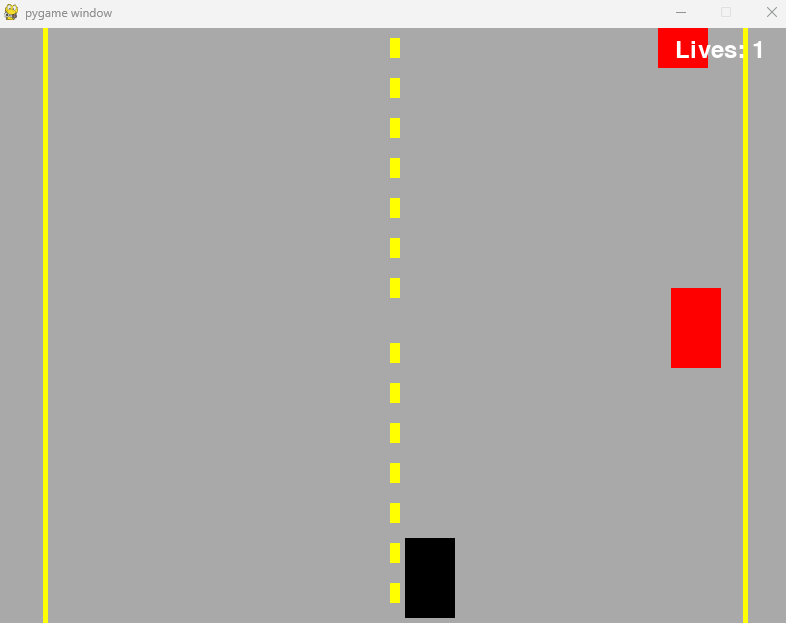
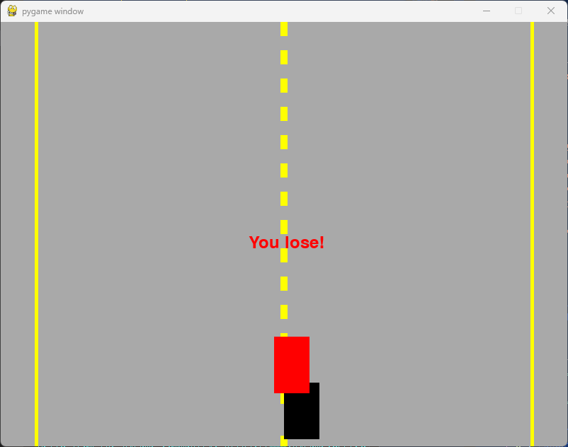

# rcar2d-pygame




## Overview
`rcar2d-pygame` is a 2D race car game built using Python and the Pygame library. The objective of the game is to navigate your car along a road while avoiding obstacles. The game features continuous road lines and a lives system, where the player has three lives to start with. If the player collides with an obstacle, they lose a life. The game ends when all lives are lost.

## Features
- Continuous yellow lines on both sides of the road to simulate the road boundaries.
- Moving road lines to create a sense of motion.
- Randomly generated obstacles that the player must avoid.
- Lives system with a display of remaining lives on the top right corner of the screen.
- Collision detection with obstacles, displaying a message when an accident occurs.
- Game over message when all lives are lost.

## Controls
- **Left Arrow Key**: Move the car to the left.
- **Right Arrow Key**: Move the car to the right.

## How to Play
1. Run the game using Python.
2. Use the left and right arrow keys to navigate your car.
3. Avoid obstacles to prevent losing lives.
4. The game ends when all lives are lost.

## Installation
1. Ensure you have Python installed on your system.
2. Install the Pygame library using the following command:
    ```sh
    pip install pygame
    ```
3. Clone the repository or download the source code.
4. Run the `rcar2d.py` file to start the game:
    ```sh
    python rcar2d.py
    ```

## Running the Game

### On Unix-based Systems (Linux, macOS)
1. Add a shebang line at the top of `rcar2d.py`:
    ```python
    #!/usr/bin/env python3
    ```
2. Make the file executable:
    ```sh
    chmod +x rcar2d.py
    ```
3. Run the script directly:
    ```sh
    ./rcar2d.py
    ```

### On Windows
1. Create a batch file named `run_game.bat` in the same directory as `rcar2d.py`.
2. Add the following content to the batch file:
    ```bat
    @echo off
    python rcar2d.py
    pause
    ```
3. Double-click the `run_game.bat` file to execute your Python script.

## Code Structure
- `rcar2d.py`: The main game file containing all the game logic and rendering code.
- `README.md`: This file, providing an overview and instructions for the game.

## Future Improvements
- Add more levels with increasing difficulty.
- Implement different types of obstacles.
- Add sound effects and background music.
- Improve the graphics and animations.

## License
This project is licensed under the MIT License. See the LICENSE file for more details.

Enjoy the game!
